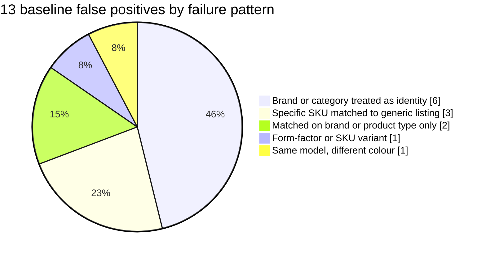
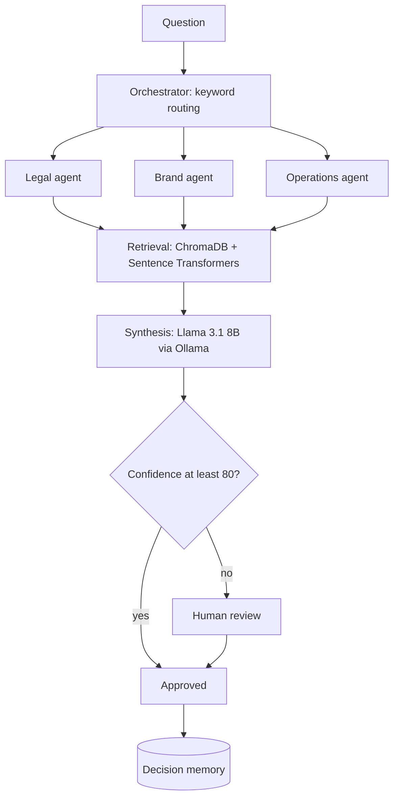

<!-- Save as README.md in a PUBLIC repo named exactly: Sumanth3036 -->

<div align="center">


[](https://github.com/Sumanth3036)


[Selected work](#selected-work) | [Research](#inside-the-research) | [System design](#system-design-think9) | [Experience](#experience) | [Stack](#stack) | [Contact](#contact)

</div>

---

## Snapshot

```text
name          Sumanth Ponugupati
role          Backend & AI/ML Engineer  |  B.Tech ECE, Amrita Vishwa Vidyapeetham (2026)
location      Pune, India
now           Trainee Engineer @ omniXM: built an internal product that monitors the health of all company products
before        Research Intern @ IIT Kharagpur (LLM data agents)  |  ML Intern @ LogiXair (real-time telemetry)
papers        3 published (IEEE ICSSES 2025 as sole author)
looking_for   Backend Engineer | AI/ML Engineer | Software Engineer  (Pune, Bengaluru, Hyderabad, remote)
```

## Selected work

| Project | What it proves | Stack |
|---|---|---|
| [**Data Agent Reliability Evaluation**](https://github.com/Sumanth3036/Data-Agent-Reliability-Evaluation) | Entity-resolution F1 **0.8992 to 0.9333**; found a sampling bug that tested only 3 of 900 true matches | Python, GPT-OSS-120B |
| [**Think9**](https://github.com/Sumanth3036/Think9-Multi-Agent-Knowledge-Assistant) | Multi-agent RAG with a confidence gate, human review and decision memory, with a pytest suite | FastAPI, Streamlit, ChromaDB, Llama 3.1 8B |
| [**DefectAI**](https://github.com/Sumanth3036/defectai) | **0.842 ROC-AUC** on unseen repositories; leakage-safe split; SHAP explanations | PyTorch, CodeBERT, FastAPI, React |
| [**Distributed Traffic Surveillance**](https://github.com/Sumanth3036/Distributed-Traffic-Surveillance-System) | Fault-tolerant master-worker pipeline: **+40% throughput, zero task loss** under worker failure | FastAPI, RabbitMQ, Redis, YOLOv11 |
| [**CipherTalk**](https://github.com/Sumanth3036/secure-chat-app) | Encrypted chat (AES-256, JWT, OTP) with a **96%+** accurate phishing classifier | FastAPI, CatBoost, MongoDB |
| [**SafeRoute**](https://github.com/Sumanth3036/Saferoute-Multi-Modal-Optimization-for-Crisis-Management-and-Evacuation) | Evacuation routing with **92.6% / 91.9%** earthquake / flood accuracy; [IEEE ICSSES 2025](https://ieeexplore.ieee.org/document/11009902) | Python, OSMnx, A*, Dijkstra |

## Inside the research

Budgeted pilot on Abt-Buy entity resolution (175 pairs), with failures analysed instead of just tuned away. The baseline made 13 false positives; grouping them showed 5 distinct failure patterns, and targeted prompt fixes corrected 9 of them.

| | Precision | Recall | F1 |
|---|---|---|---|
| Baseline | 0.8169 | 1.0000 | 0.8992 |
| After fixes | 0.9032 | 0.9655 | **0.9333** |

Precision rose and recall dropped slightly; the full trade-off, new errors and limitations are in the [report](https://github.com/Sumanth3036/Data-Agent-Reliability-Evaluation/blob/main/REPORT.md).



**Lesson:** my first schema-matching run looked fine but sampled only 3 of 900 true matches. Check what your evaluation is actually measuring before trusting the score.

## System design: Think9



The model only sees retrieved evidence, must cite sources, and a human decides whenever confidence is low.

## Experience

| When | Where | What I did |
|---|---|---|
| Aug 2026 to now | **omniXM**, Trainee Engineer | Built an internal product end to end that monitors the health of all company products; redesigned AI systems |
| Aug to Sep 2026 | **IIT Kharagpur**, Research Intern | LLM data-agent reliability; reviewed 100+ papers (SIGMOD, VLDB, SIGIR, ICDE, CIKM) |
| May to Jul 2025 | **LogiXair**, ML Intern | Async telemetry APIs at **50 Hz, under 5 ms latency**; ML fault detection cut position error by **52%** |

## Stack

<div align="center">


</div>

**Backend** FastAPI, REST, WebSocket, JWT, async Python, microservices, RabbitMQ
**AI/ML** PyTorch, TensorFlow, scikit-learn, CatBoost, YOLOv11, RAG, LLM evaluation
**Infra** Docker, GitHub Actions (CI/CD), AWS, Linux

## Publications

- **SafeRoute: Multi-Modal Optimization for Crisis Management and Evacuation**, IEEE ICSSES 2025 (sole author) | [IEEE Xplore](https://ieeexplore.ieee.org/document/11009902)
- **Embedded VPN Router Using Raspberry Pi**, ETCOM 2025 | [Semantic Scholar](https://www.semanticscholar.org/paper/Embedded-VPN-Router-Using-Raspberry-Pi-Renesh-Yallamelli/d8e2aa16d37d8f88aef62ad0baab0969131ccdcd)
- **Revolutionizing University Placements: Advanced Technologies for Streamlined Ecosystems**, ICRDICCT 2025

## Contact

<div align="center">

[](https://sumanth3036.github.io/my-portfolio/)
[](https://www.linkedin.com/in/sumanthponugupati/)
[](mailto:sumanthponugupati@gmail.com)


</div>
